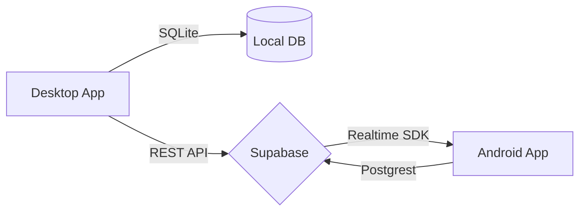

# System Overview: Clinic Manager & Viewer

## Architecture
Hệ thống bao gồm hai thành phần chính kết nối qua Supabase:

1.  **Clinic Manager (Desktop)**:
    *   **Ngôn ngữ**: Python + PySide6.
    *   **Database**: SQLite nội bộ + Supabase Cloud.
    *   **Vai trò**: Quản lý chính, nhập liệu bệnh nhân, khám bệnh, kê đơn và in ấn.
    *   **Sync**: Tự động push thay đổi dữ liệu (Insert/Update) lên Supabase Realtime.

2.  **ClinicViewer (Android)**:
    *   **Ngôn ngữ**: Kotlin + Jetpack Compose.
    *   **Database**: Supabase (Read-only / Realtime Sync).
    *   **Vai trò**: Giúp bác sĩ/nhân viên xem nhanh hồ sơ bệnh nhân và đơn thuốc từ xa qua điện thoại.

## Data Flow

## Setup & Build
*   **Desktop**: Cài đặt python dependencies và dùng `pyinstaller` để đóng gói.
*   **Android**: Dùng Android Studio (với AGP 8.9.1) để build APK.
