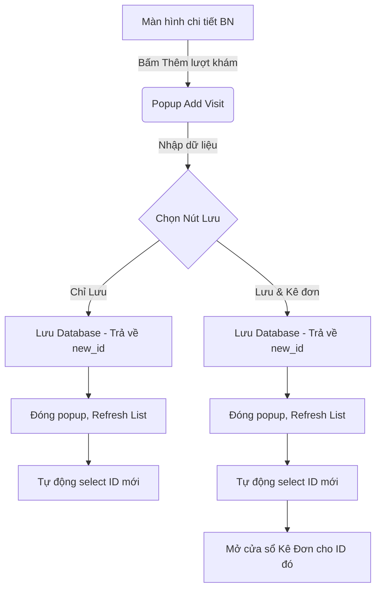

# Specification: Cải thiện luồng Thêm lượt khám -> Kê đơn

## 1. Executive Summary
Thao tác "Thêm lượt khám -> Kê đơn" là cốt lõi của phần mềm phòng khám, xảy ra thường xuyên nhất. Hiện tại, luồng này đang đứt gãy do nhiều pop-up không cần thiết và bắt người dùng phải thao tác chọn lại dữ liệu vừa tạo. Việc tinh giản luồng làm việc sẽ tiết kiệm thao tác, giảm nguy cơ chọn nhầm bệnh nhân.

## 2. User Stories
Là một bác sĩ, tôi muốn vừa lưu lượt khám mới vừa mở ngay cửa sổ kê đơn chỉ với 1 click, để tôi có thể làm việc liên tục mà không bị phân tâm bởi các thông báo rườm rà.

## 3. Database Design
Không thay đổi kiến trúc DB. Tuy nhiên, thay đổi hành vi hàm API backend/local:
- `add_patient_db(..., diagnosis)` -> insert thành công -> trả về `c.lastrowid` làm `new_id` thay vì trả về `True`.

## 4. Logic Flowchart

## 5. API Contract / Internal API
- Hàm backend trả về ID: `database.add_patient_db() -> int | None`
- Interface Callback cho UI cha: `on_add_success(action: str, new_id: int)`
  - `action`: ["refresh", "prescribe"]

## 6. UI Components
- Nút bấm mới (`btn_save_and_prescribe`): Style màu xanh nổi bật, làm nút Primary (mặc định phím Enter).
- Nút bấm cũ (`btn_save`): Chuyển thành màu phụ, chỉ làm nhiệm vụ "Chỉ Lưu".
- Đã xóa: Bỏ `QMessageBox.information("Thành công")` sau khi lưu.

## 7. Hidden Requirements
- Debounce: Phải disable các nút sau khi click để tránh bác sĩ click đúp sinh ra 2 dòng trên database.
- Error Handling: Nếu database lưu lỗi (trả về `None`), phải bật lại các nút bấm và hiển thị lỗi để bác sĩ có thể làm lại.
